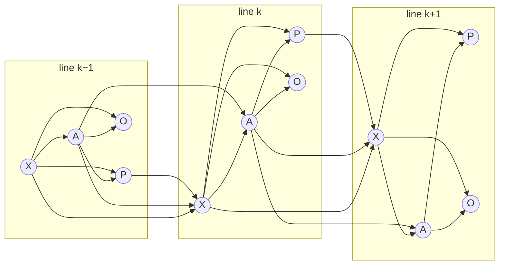

# DynaSurv — Project State Report

**Causal treatment recommendation for metastatic breast cancer from real-world treatment sequences**
Branch `feature/residual_survival` · HR+HER2− ESME cohort · 2026-08-28

---

## 1. Introduction

Metastatic breast cancer (mBC) is managed as a sequence of therapy lines, each ended by a progression event and each narrowing the space of remaining options through accumulated toxicity and resistance. Within a line, treatment choice follows subtype-level standards of care; as patients progress to later lines, their profiles diverge from the populations those guidelines were built on, and the evidence base thins precisely where the decision is hardest. Enumerating treatment *sequences* in prospective trials is combinatorially infeasible, which makes real-world registries — capturing full longitudinal trajectories at scale — the natural complementary evidence source. But real-world data cannot be used naively: assignment is driven by patient state, so outcome differences across arms mix treatment effect with confounding by indication.

The project therefore combines **survival analysis** in a discrete-time formulation suited to line-structured trajectories, **causal inference** to move from association to intervention ("what survival would *this* patient gain from arm $a$"), and a **sequential deep architecture** encoding the full treatment history. Since the first paper draft, the project has evolved from a prediction model into a **treatment recommendation system** with explicit eligibility mechanisms, and a substantial empirical program on the cohort — identifiability diagnostics, era effects, data-quality audits — has reshaped the design. This report covers the formulation (§2–3), the recommendation system and its safeguards (§4), the cohort evidence behind them (§5), validation status (§6), and open issues with measured impact (§7).

## 2. Problem formulation

**Patient representation.** Each patient is a triple of sequences over treatment lines $k = 1,\dots,L$ ($L \le 4$): clinical state $X_k$ at line onset, treatment $A_k$, and outcomes $(P_k, O_k)$ — progression-free and overall survival from the line's first day. A line ends at progression; the gap before the next line is the *buffer time* $d$. The information available at the line-$k$ decision is the history $H_k = (X_{1:k},\, A_{1:k-1},\, P_{1:k-1})$.

**Causal structure.** The joint distribution factorizes along the clinical decision process,

$$
P(X_{1:L}, A_{1:L}, P_{1:L}, O_{1:L}) = \prod_{k=1}^{L} \underbrace{P(X_k \mid H_k^-)}_{\text{state transition}}\; \underbrace{P(A_k \mid H_k)}_{\text{assignment}}\; \underbrace{P(P_k \mid H_k, A_k)}_{\text{PFS}}\; \underbrace{P(O_k \mid H_k, A_k)}_{\text{OS}},
$$

with line-$k$ factors defined on the event that the patient is alive at its onset. $O_k$ is terminal (death is absorbing); $P_k$ plays a dual role — an outcome of line $k$ *and* a driver of the next state $X_{k+1}$, since progression triggers the next line. This is exactly where static causal adjustment fails and a sequential view is required.

**Figure 1.** Sequential causal structure. $X$ patient state, $A$ treatment, $P$ progression-free survival, $O$ overall survival. $O$ is terminal; $P$ feeds the next state, and assignment conditions on the previous arm.

**Estimand.** With $O_k(a)$ the potential OS under arm $a$, the target is the counterfactual survival curve and its scalar summary:

$$
S_a(t \mid H_k) = \mathbb{P}\big(O_k(a) > t \mid H_k\big), \qquad \mathrm{RMST}_a(\tau) = \int_0^{\tau} S_a(t \mid H_k)\, dt .
$$

The intervention is **static and single-line**: we set $A_k = a$ and let future lines follow the observed clinical policy, so the estimand is the *total* effect of the line-$k$ choice — direct effect plus the pathway mediated by the downstream care that choice induces. Since $A_{k+1:L}$ are descendants of $A_k$, not common causes, marginalizing them is not confounding; and this composite quantity is precisely what the clinician commits to at line $k$. Its validity presumes the deployment-time downstream policy stays close to the training-data one; we do not claim to recover the optimal *dynamic regime*, which would need sequential ignorability at every future line and an explicit state-transition model.

**Identifiability** rests on the three standard assumptions: **consistency** ($A_k = a \Rightarrow O_k = O_k(a)$), **positivity** ($P(A_k = a \mid H_k) > 0$ on the support of $H_k$), and **sequential ignorability** ($A_k \perp \{O_k(a), P_k(a)\}_a \mid H_k$). The first draft treated consistency as unproblematic and positivity as a footnote. The diagnostics of §5 showed both are *materially violated for specific arms* — `OTHER` covers 736 distinct drug-flag combinations (modal regimen share 0.16), `ET+TT` 344, and several arms are era-confined, hence structurally non-positive. Rather than assuming these away, the recommendation system now enforces them mechanically.

## 3. Model

**Figure 2.** Architecture: a shared LSTM encoder over line tokens $u_j = [X_j, A_{j-1}, \rho^P_{j-1}]$ produces $h_k$; per-treatment progression heads feed a predicted-progression summary $\rho^P$ back into the next token, and per-treatment survival heads score each candidate arm, ranked by RMST. (Known draft typo: the upper head row should read $f^O_a / \hat S^O_a$.)

The architecture models only what the recommendation needs — $P(O_k \mid H_k, A_k = a)$ per candidate arm:

- **Shared history encoder.** A unidirectional LSTM whose gates are additionally conditioned on the feature embeddings and buffer time $d$, giving time-aware transitions between lines. Its token at line $j$ concatenates $X_j$, the *previous* arm $A_{j-1}$, and a learned progression summary $\rho^P_{j-1}$ from the progression head of the administered arm — carrying treatment-response history forward in a form well-defined under censoring. Encoder and progression heads are recurrently coupled, trained end-to-end.
- **Per-treatment heads** (one $f^P_a$, one $f^O_a$ per arm, Shalit-style): treatment is not an input feature but selects which head is evaluated. Both output discrete hazards $\hat\lambda_a(t \mid h_k) = \sigma(f_a(h_k)_t)$, with $\hat S_a(t \mid h_k) = \prod_{s \le t}(1 - \hat\lambda_a(s \mid h_k))$.
- **Losses.** Discrete-time logistic-hazard negative log-likelihood under right-censoring (a masked binary cross-entropy over hazards); each observed line supervises exactly one head per outcome. Progression is an auxiliary multitask signal: its latent drivers overlap those of mortality, and early progression at line $j$ proxies response to $A_j$.
- **Representation balancing.** The encoder can be regularized toward treatment-balanced representations: pairwise integral probability metrics between per-arm representation sets (RBF-kernel MMD and an entropy-regularized Wasserstein term), plus an adversarial propensity head through a gradient-reversal layer (GRL).

**Regularization status — functional but switched off.** A July audit found the balancing machinery silently inert: the minimum per-batch group size for an IPM pair was derived from the hidden size (128, equal to the batch size), so across 123 real training batches *zero* pairs ever qualified; the EMD term additionally crashed on a device mismatch the dead gate had masked, and the propensity loss was double-softmaxed and subtracted with no GRL. All fixed (explicit `min_ipm_group_size = 16` → ~6.5 usable pairs/batch; device-safe EMD; GRL with the adversarial weight in its $\alpha$; the propensity term excluded from checkpoint selection, where its minimax sign would invert model choice). With all $\lambda = 0$ the refactor reproduces the pinned baseline bit-for-bit; at $\lambda_{\text{prop}} = 1.0$ the adversary demonstrably strips treatment information without divergence. The shipped configs keep **all balancing weights at 0** pending a sweep — and the representation's *excess* treatment-predictability at $\lambda = 0$ is only ~+0.03–0.04 accuracy over the per-line majority class, so the expected gain from heavy balancing is modest.

## 4. The recommendation system

At inference the model scores every candidate arm by $\widehat{\mathrm{RMST}}_a(\tau)$ from its OS head and recommends the argmax. Everything added since the draft concerns *which arms are allowed into that comparison*. Four independent eligibility filters compose before the argmax; arms failing any are set to $-\infty$ so they can never surface as advice, and when **no** arm survives for a patient the system returns an explicit abstention ($-1$) rather than defaulting to arm 0. All filters are fit on the **training partition only**, so held-out outcomes can never shape eligibility.

| # | Filter                  | Level                           | Rule (current config)                                                           | Protects against                                        |
| - | ----------------------- | ------------------------------- | ------------------------------------------------------------------------------- | ------------------------------------------------------- |
| 1 | Arm support             | arm × line                     | ≥ 200 training observations                                                    | arms with too little data to say anything               |
| 2 | Well-definedness        | arm                             | exclude`NO TREATMENT`, `OTHER`, `ET+TT`                                   | consistency violations (no single intervention)         |
| 3 | Outcome/horizon support | arm × line                     | ≥ 30 events and ≥ 100 records with known status to the line's horizon$\tau$ | raw counts with no outcome information at$\tau$       |
| 4 | Propensity / positivity | arm × line ×**patient** | out-of-fold propensity$\hat e(a \mid H_k) \ge$ floor (0.01)                   | recommending arms never given to patients like this one |

**Table 1.** The four eligibility filters (`recommendation_filters.md`; thresholds from `configs/config.toml`).

**Filters 1–3 are global.** Filter 1 is the broadest cut — everything downstream only removes arms; the same valid-arm set also gates which observations enter the IPM and propensity losses, so the encoder is never pressured to "balance" noise. Filter 2 withdraws arms that are not a well-defined intervention: `NO TREATMENT` is a line-1 coding artefact (207/0/0/1 occurrences across lines 1–4), and `OTHER`/`ET+TT` bundle hundreds of distinct regimens. These records are **not deleted** — a patient who received `OTHER` at line 2 still contributes that line to their history and the shared encoder; only recommendability is withdrawn. Filter 3 exists because 200 patients on an arm is not the same as identifiable survival information at the line's RMST horizon: it requires deaths observed before $\tau$ (which pin survival on $[0,\tau]$) plus records followed at least to $\tau$.

**Filter 4 is the positivity gate in the causal sense** — the only patient-level one. A multinomial propensity model per line (`PropensityOverlapModel`) is fit over the arms passing filters 1–3, on strictly pre-treatment features (dynamic covariates through the current line, statics, prior arms and buffer times — never the current arm). Factual propensities are estimated out-of-fold (5-fold stratified CV) so the diagnostic is not inflated by in-sample scoring. At inference an arm is masked for a patient when $\hat e(a \mid H_k)$ falls below the floor; effective-sample-size and low-propensity diagnostics are logged even when nothing is masked, and floor = 0 is supported for audit-only operation.

**Cohort design decisions that make the filters meaningful.** The identifiability program (`improvements.md`) reframed calendar era as two distinct problems — *availability* (a positivity issue only restriction fixes) and *secular trend* (ordinary confounding, fixable by conditioning). Accordingly: the primary cohort is restricted to patients whose **first line starts in 2018+** (patient-entry based so no trajectory is severed mid-sequence: 6,256 patients / 13,257 line-records), a calendar covariate is exposed to the encoder *inside* the window, validation uses a **temporal split at 2021** (68/32) rather than a random one, and per-line RMST horizons were cut to **[24, 18, 12, 12] months** — a decision *coupled* to the split year, because the holdout is by construction the least-followed slice: at a 2022 cutoff, 0% of line-2 holdout records reach 24 months and every RMST would be extrapolation.

**Measured effect.** Filters 1–3 already narrow the recommendable set sharply: 4 arms at lines 1–2 (`ET alone`, `ET+ANTI-CDK`, `MONOCT std`, `POLYCT`), only 2 at lines 3–4 (`MONOCT std`, `POLYCT`). The patient-level gate then does real work on top: in the July run (floor 0.1, Crump-style), arms that had sailed through the global filters proved unidentifiable for most individuals — `MONOCT std alone` at line 1 cleared the floor for only **6.6%** of holdout patients, `POLYCT` for 12.9%, `ET alone` for 40.6%. Gating shifted line-2 advice materially (CDK 83.6% → 56.0% of recommendations, MONOCT 0.1% → 25.9%), cut the mean number of eligible line-1 arms from 4.00 to 1.58, and abstained for ≤ 0.7% of patients. Factual metrics were essentially unchanged (average C-index 0.651 / IBS 0.106 vs 0.647 / 0.107 ungated) — expected, since the gate changes *advice*, not fit. The shipped default floor is a conservative 0.01 pending the propensity-model fix of §7.

## 5. Cohort diagnostics and data analysis

A parallel empirical program on the HR+HER2− cohort (19,865 patients, 63,317 line-records, 11 arms, lines 1–4) produced the evidence behind §4. Four findings stand out.

**(a) Treatment sequences genuinely re-use arms — history matters.** Among the 7,131 patients with four lines, **75% repeat a treatment category** (7,011 repetition events); only part are continuations — 22% of patients repeat *non-consecutively*, i.e. re-challenge after switching away (Figure 3), and all 15 possible four-line repetition shapes occur. A per-line model without sequence structure discards the strongest later-line signal — consistent with §7, where prior treatment dominates next-arm prediction.

**Figure 3.** Repetition of treatment categories over the first four lines: patients by repetition kind, repetition events per category (consecutive vs re-challenge), and all 15 sequence shapes.

**(b) Calendar era was the dominant unmodeled confounder.** No model covariate encoded calendar time, yet the treatment mix moved drastically — `ET+ANTI-CDK` from 0% (pre-2014) to 66% of line-1 starts (2022); `CT+ANTI-ANGIO` from 12–16% to ~0.3% after bevacizumab's withdrawal — and era equally drives censoring (death observed for 94% of 2008 entrants vs 21% of 2022 entrants at database lock). An era-aware propensity model shows how optimistic era-blind overlap was: `ET+ANTI-CDK` has $\hat e < 0.01$ for **36.5%** of the cohort era-aware vs 0.4% era-blind. Meanwhile crude within-category survival is flat across 15 years at line 1 (Figure 4), and IPTW+IPCW adjustment (80 covariates, stabilized truncated weights) balances only the arms available across the whole period (post-weighting max |SMD| ≤ 0.07 for `ET alone`, `POLYCT`, `MONOCT`, `OTHER`) while **failing structurally** for the era-confined ones: residual imbalance for `ET+ANTI-CDK` (0.42) and `CT+ANTI-ANGIO` (0.38) sits on *year dummies* — no weighting makes a 2010 patient a plausible CDK recipient (Figure 5). That is a positivity violation visible in raw data, and it is what filter 4 and the 2018+ window operationalize. Inside the window, era is empirically inert: a calendar-only propensity model scores AUC 0.50–0.54 at every line.

**Figure 4.** Crude 24-month OS from line-1 onset by calendar year and treatment category: flat within category; gaps between categories are case mix, not treatment effects.

**Figure 5.** IPTW/IPCW diagnostics: balance before/after weighting, effective sample size, calendar-era overlap. Only 4 of 9 arms end up comparable; the failures are era-confined arms whose worst residual imbalances load on year dummies.

**(c) Later-line "improvement" is about half case mix.** Lines 2–4 show apparent gains in crude 12-month OS (+4.3 / +10.9 / +11.9 points, 2008–11 → 2020–24). Holding prior ET/CT exposure fixed by direct standardization cuts these to **+1.1 / +5.1 / +5.5** — and what survives lands entirely between 2008–11 and 2012–15, flat since, including across the CDK4/6 rollout (Figure 6). The composition shift is dramatic (line-4 starts move from ~74% prior ET+CT to ~70% prior ET+CT+CDK4/6, a stratum that did not exist before 2016), compounded by selection: the share of a line-1 cohort reaching line 2 within 4 years falls from ~70% to 59% after the CDK rollout — later-line cohorts became a smaller, more selected slice. Two indexing traps documented in `data_analysis/README.md` (never index time-to-line-$k$ by the later line's own calendar year; require 80% milestone reachability before quoting a part-observed year) each manufacture a spurious finding if ignored.

**Figure 6.** 12-month OS at lines 2–4 by era: per-stratum trends (top) and crude vs history-standardised bars (bottom). The black-vs-grey gap is the share of "improvement" explained by who reaches the line.

**(d) Imputed covariates can reverse real trends.** Performance status exists twice: dated raw measurements (`data_raw/metperf.parquet`) and the imputed, gap-free `X_mpps` the model consumes. The observed trend is a modest monotone *deterioration* (PS 0 falls 42.0% → 37.1%, PS ≥ 2 rises 18.9% → 22.9%, 2008–12 vs 2018–22); the imputed column shows PS 0 *rising* — a pure coverage artefact (real measurements near line-1 start climb from 31% to 80% of patients, and the imputation mode-fills at PS 1, compressing the impaired tail: 20% of observed PS 4 become imputed PS 1). Where an observation exists agreement is 93.5% — locally decent, globally misleading (interactive figure: `data_analysis/plots/mpps_by_year.html`). The general lesson: any imputed `X_` covariate whose coverage improves over time can manufacture a temporal trend; covariate trends must be read off raw tables.

## 6. Validation status

**Factual fit.** On the earlier full-cohort, random-split evaluation the model is competitive with per-line baselines and relatively strongest at later lines, where sequence information exists (Table 2). On the current 2018+ cohort with the temporal split — a deliberately harder, more honest benchmark — the gated run reaches average C-index **0.651** / integrated Brier **0.106**.

| Line | Model                   | C-index ↑                     | IBS ↓                         | ECE ↓             |
| ---- | ----------------------- | ------------------------------ | ------------------------------ | ------------------ |
| 1    | Cox PH / DeepSurv / RSF | 0.752 /**0.754** / 0.749 | 0.106 /**0.100** / 0.111 | 0.024 / 0.052 / — |
|      | Ours                    | 0.731                          | 0.135                          | 0.124              |
| 2    | Cox PH / DeepSurv / RSF | 0.721 / 0.728 / 0.723          | 0.109 /**0.105** / 0.112 | 0.014 / 0.039 / — |
|      | Ours                    | **0.736**                | 0.116                          | 0.094              |
| 3    | Cox PH / DeepSurv / RSF | 0.726 /**0.731** / 0.724 | 0.123 /**0.116** / 0.126 | 0.012 / 0.041 / — |
|      | Ours                    | 0.730                          | 0.119                          | 0.050              |
| 4    | Cox PH / DeepSurv / RSF | 0.719 / 0.710 / 0.709          | 0.141 / 0.144 / 0.147          | 0.024 / 0.089 / — |
|      | Ours                    | **0.722**                | **0.130**                | 0.034              |

**Table 2.** Factual prediction quality by line, full-cohort random-split evaluation (paper draft). All discrimination figures are inflated by the covariate leak of §7 and will be re-run without it.

**Calibration.** Predicted-vs-observed curves are near-diagonal at lines 3–4 but systematically shifted at line 1 (predicted survival underestimates observed), attenuating at line 2 (Figure 7). The interpretation is distribution shift intrinsic to the shared encoder: line-1 patients are the healthiest subpopulation (reaching line $k$ requires surviving lines $1..k{-}1$), so a pooled hazard scale is too pessimistic there. The same pattern appears in RMST on the temporal holdout: line-1 predicted RMST is within −1.5% of the Kaplan–Meier value, lines 2–4 underpredict by 14–22%. Planned fix: per-line, per-arm isotonic recalibration on a held-out fold — monotone, hence rank-metric-preserving.

**Figure 7.** Calibration at 6/12/18/24-month horizons by treatment line (predicted-survival ventiles vs Kaplan–Meier observed), before post-hoc recalibration.

**Counterfactual validation harness.** Because counterfactual accuracy is unobservable on real data, a semi-synthetic benchmark was built: real covariates, known Cox–Weibull outcome DGP (3 arms, per-arm coefficients for heterogeneous effects, softmax-confounded assignment), closed-form true potential outcomes. Its central result calibrates the whole evaluation: sweeping *observed* confounding until overlap collapses (66% of records near positivity violation) leaves outcome-regression baselines (Cox, DeepSurv with treatment as covariate) **unbiased** — g-formula estimators tolerate observed confounding when the model form is adequate; only variance suffers. What breaks them is *hidden* confounding, producing a clean monotone RMST bias (Cox: −0.02 → +0.73 as the hidden coupling sweeps 0 → 4). DynaSurv's counterfactual claims will be scored on that hidden-confounding axis; the DynaSurv-on-synthetic run itself still needs a config retuned to the 3-arm setting before its numbers mean anything.

## 7. Known issues and next steps

**(1) A post-treatment covariate leaks the current line's outcome — top-priority fix.** `X_onset_to_progression` in the model-entry data *is* the current line's duration (correlation 1.000 with line end minus line start, at every line). It is a consequence of treatment response — a mediator on the $A_k \to O_k$ path — fed to the LSTM as an ordinary covariate. Conditioning on it biases the total-effect estimand itself (classic overadjustment), so no positivity or balancing work repairs it. Alone it predicts survival at C ≈ 0.83–0.85 per line; a controlled ablation (same seed and harness, only the column removed) drops average C-index **0.657 → 0.582** and moves IBS 0.122 → 0.139. Every discrimination figure reported to date is inflated by it; honest baseline-covariate performance is ≈ 0.58 pending retraining.

**Status update (2026-09-04) — code-level fix landed, data-level picture is mixed.** `ESMEOnlineDataModuleCV` and `ESMEProgressionOnlineDataModuleCV` (`src/CausalSurv/data/datamodule_cv.py`, `datamodule_progression.py`) now drop `X_onset_to_progression` by name from the `X_`-prefixed dynamic and static feature sets before anything reaches the encoder — an `excluded_x_columns` constructor arg, defaulting on for every caller, surfaced in `configs/config.toml` and threaded through `TrainDynasurvCausal.py`; the same guard was added to the standalone `scripts/Deepsurv_baseline.py`, where it previously existed only as a dead commented-out line. Verified end-to-end: on a snapshot that contains the column, excluding it removes exactly one feature dimension (72 → 71).

Separately — and discovered only while verifying the above, not caused by it — the real-cohort parquet the main pipeline currently reads (`data/model_entry_imputed_data_HR+HER2-_stable_types_categorized_V2.parquet`) **no longer contains the column at all** (71 `X_` columns, not 72). Its mtime, 2026-07-30 20:40, is the same day the leak was first logged, so it looks like an upstream regeneration already stripped it from this file before this fix existed — which makes the "still in the active pipeline" claim above stale *for that specific file*, as originally written. The frozen semi-synthetic snapshots under `data/synthetic/` still carry the column (72 `X_` columns each), so the counterfactual-validation harness of §6 was exposed until the code-level guard above closed it.

Net effect: the leak can no longer reach the encoder from any data source, by construction, going forward. What is **not** yet established: (a) whether any figure already in this report — Table 2, the §4 gated-run numbers, the semi-synthetic results — was computed before or after the 2026-07-30 upstream data change, so no existing number can yet be certified leak-free on that basis alone; (b) the remaining 71 `X_` columns have not been audited for the same defect (does the value at line $k$ correlate with anything realized after the line-$k$ start?). Both are unchanged open items in the roadmap below. The companion `X_time_between_onsets` (the *previous* line's duration) was checked and is legitimate.

**(2) The propensity head is too weak to gate on.** An external gradient-boosting model on raw pre-treatment features beats the LSTM propensity head at every line, and the head's log-loss is worse than the base rate — actively miscalibrated, not merely weak:

| Line | GBM macro-AUC | LSTM head macro-AUC | GBM Δlog-loss vs base | Head Δlog-loss vs base |
| ---- | ------------- | ------------------- | ---------------------- | ----------------------- |
| 1    | 0.625         | 0.566               | +0.076                 | **−0.382**       |
| 2    | 0.678         | 0.605               | +0.147                 | **−0.106**       |
| 3    | 0.692         | 0.573               | +0.105                 | **−0.171**       |
| 4    | 0.701         | 0.581               | +0.073                 | **−0.448**       |

**Table 3.** Propensity-model quality on the 2021+ temporal holdout (positive Δ = better than predicting marginal arm frequencies).

The constructive readings: assignment *is* predictable from recorded covariates — evidence for, not against, the plausibility of ignorability — and the feature ablation is informative (calendar-only AUC ≈ 0.50 confirms era is inert inside the window; prior-treatment history is the strongest signal at lines 2–4, AUC 0.64–0.66). The likely cause is architectural: the GBM sees explicit prior-arm one-hots while the head reads a 16-dim embedding folded through the recurrence. Fix, in order of preference: use external GBM propensities for filter 4 (decoupling the positivity gate from the survival encoder), or feed explicit prior-arm indicators to the head. Until then the gate runs at the conservative 0.01 floor, and the July numbers (floor 0.1) demonstrate the *mechanism*, not the specific advice shares.

**(3) Smaller open items.** Static patient features are silently dropped (the LSTM initial-state projections are commented out; the tensors reach the model and do not influence it). All balancing weights remain 0 — functional (§3) but untuned. The residual and multi-head variants are stale full copies of the base model predating the July fixes, and the evaluator hard-asserts the base class, so the residual experiment cannot currently be scored. The counterfactual-validation section of the paper is still empty pending the semi-synthetic DynaSurv run.

**Roadmap.** (i) Leaked-covariate removal is now code-enforced (§7-1) — audit the remaining 71 `X_` columns for the same defect, then retrain and rebaseline every number, since no figure in this report is yet certified to postdate the fix; (ii) swap filter 4 onto external GBM propensities and re-tune the floor from the ESS/low-propensity audits; (iii) $\lambda$ sweep for the now-functional balancing terms; (iv) per-line isotonic recalibration; (v) DynaSurv on the semi-synthetic benchmark, scored on the hidden-confounding axis; (vi) fold the residual variant onto the fixed base class so the ablation is runnable.

---

*Sources: `latex/first_draft.tex` (formulation, model, factual validation); `recommendation_filters.md` + `configs/config.toml` (§4); `improvements.md` (identifiability program); `data_analysis/` scripts and README (§5 figures, regenerated 2026-08); training-run and diagnostic numbers from the July 2026 sessions on `feature/residual_survival`.*
